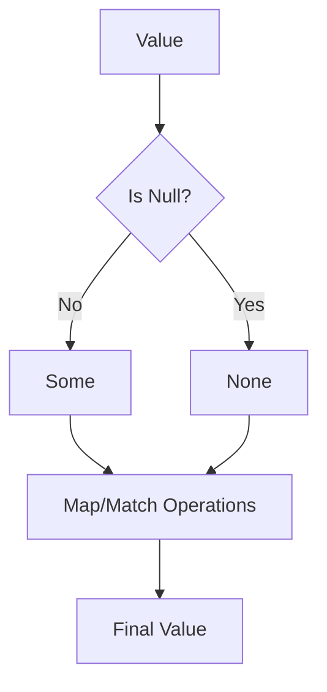
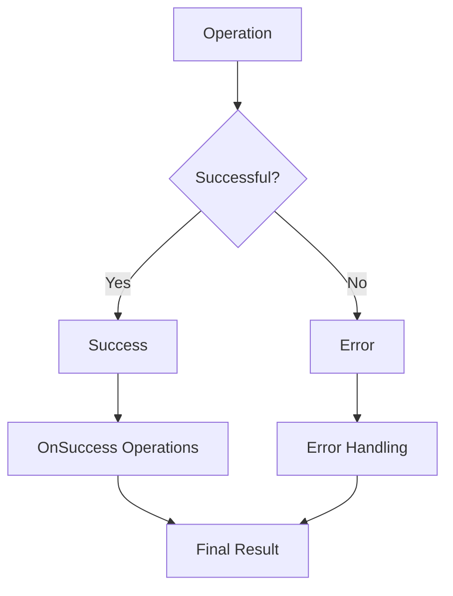
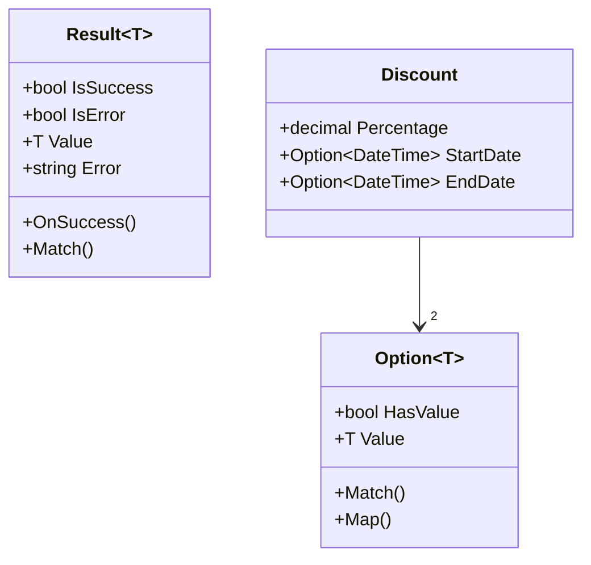
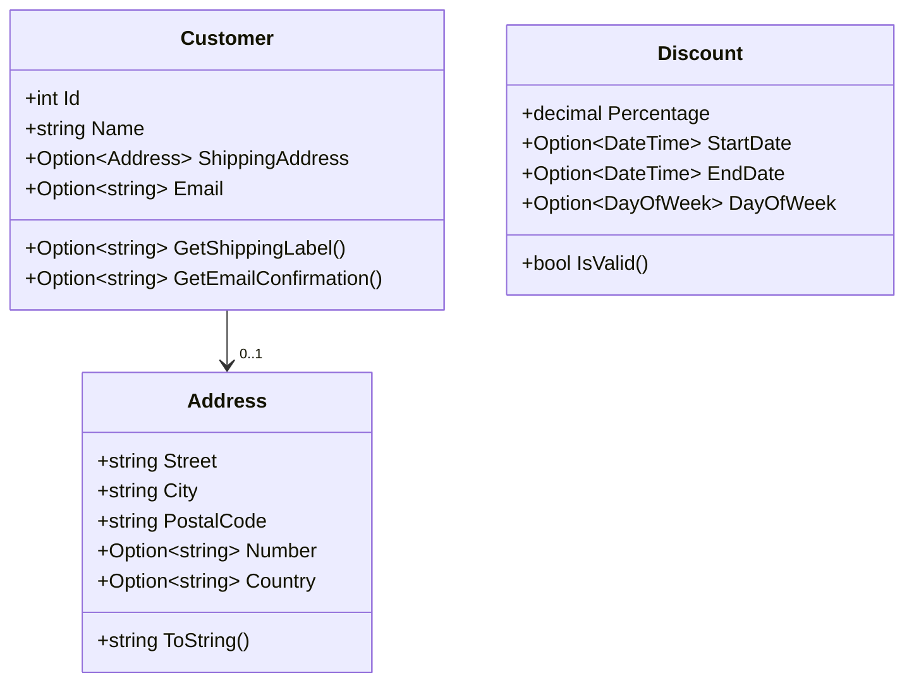

# OptionType - Functional Programming Types for C#

[](https://github.com/vvidov/OptionType/actions/workflows/build.yml)


A robust implementation of functional programming types (`Option<T>` and `Result<T>`) for C#, designed to improve null safety and error handling in your applications.

## Features

- 🛡️ Null-safe operations with `Option<T>`
- 🎯 Explicit error handling with `Result<T>`
- 🔄 Functional method chaining
- 🧪 Comprehensive test coverage
- 📦 No external dependencies

## Architecture

### Option Type Flow



### Result Type Flow



### Domain Model



## Installation

```bash
dotnet add package OptionType  # Coming soon to NuGet
```

## Usage Examples

### Option Type

```csharp
// Creating Options
var someValue = Option<string>.Some("Hello");
var noValue = Option<string>.None();

// Pattern matching
string result = someValue.Match(
    some: value => $"Got: {value}",
    none: () => "Nothing here"
);

// Chaining operations
var processed = someValue
    .Map(s => s.ToUpper())
    .Filter(s => s.Length > 3);
```

### Result Type

```csharp
// Creating Results
var success = Result<int>.Success(42);
var error = Result<int>.Error("Something went wrong");

// Processing results
var final = success.OnSuccess(value => value * 2)
    .Match(
        success: value => $"Result: {value}",
        failure: error => $"Error: {error}"
    );
```

### Real-world Example

```csharp
public class Discount
{
    public decimal Percentage { get; }
    public Option<DateTime> StartDate { get; }
    public Option<DateTime> EndDate { get; }

    public static Result<Discount> Create(
        decimal percentage, 
        Option<DateTime> startDate, 
        Option<DateTime> endDate)
    {
        if (percentage < 0 || percentage > 100)
            return Result<Discount>.Error("Percentage must be between 0 and 100");

        return Result<Discount>.Success(
            new Discount(percentage, startDate, endDate));
    }
}
```

### Type-Safe Address Implementation

This project demonstrates two approaches to implementing an Address class, highlighting the benefits of type-safe domain modeling:

#### Traditional Implementation with Result Type
```csharp
public class Address
{
    public string Street { get; set; }
    public string City { get; set; }
    public string PostalCode { get; set; }
    public string? BuildingNumber { get; set; }
    public string? Country { get; set; }

    private Address() { } // Private constructor to force using Create method

    public static Result<Address> Create(string street, string city, string postalCode, 
                                      string? buildingNumber = null, string? country = null)
    {
        if (string.IsNullOrWhiteSpace(street))
            return Result<Address>.Error("Street cannot be empty");
        if (string.IsNullOrWhiteSpace(city))
            return Result<Address>.Error("City cannot be empty");
        if (string.IsNullOrWhiteSpace(postalCode))
            return Result<Address>.Error("Postal code cannot be empty");

        var address = new Address
        {
            Street = street,
            City = city,
            PostalCode = postalCode,
            BuildingNumber = buildingNumber,
            Country = country
        };

        return Result<Address>.Success(address);
    }

    // Example of validation method returning Result<T>
    public Result<bool> ValidatePostalCode()
    {
        if (string.IsNullOrWhiteSpace(PostalCode))
            return Result<bool>.Error("Postal code is required");
            
        if (!PostalCode.All(char.IsLetterOrDigit))
            return Result<bool>.Error("Postal code can only contain letters and numbers");
            
        return Result<bool>.Success(true);
    }
}

// Usage example:
var addressResult = Address.Create(
    "123 Main St",
    "Springfield",
    "12345",
    buildingNumber: "4B",
    country: "USA"
);

addressResult.Match(
    success: address => Console.WriteLine($"Created address: {address.Street}"),
    failure: error => Console.WriteLine($"Failed to create address: {error}")
);

// Chaining validations
var validationResult = addressResult
    .OnSuccess(address => address.ValidatePostalCode())
    .Match(
        success: isValid => $"Postal code is {(isValid ? "valid" : "invalid")}",
        failure: error => $"Validation failed: {error}"
    );
```

Problems with this approach (even with Result<T>):
1. Still has mutable state (public setters)
2. No compile-time guarantees for optional fields
3. Validation logic mixed with domain model
4. No domain-specific validation rules
5. No separation of concerns
6. Validation can be bypassed by using setters

For example, this invalid operation is possible with public setters:
```csharp
var address1 = Address.Create("123 Main St", "Springfield", "12345").Value;
var address2 = Address.Create("456 Oak Rd", "Boston", "67890").Value;

// This compiles and runs! 😱
address1.Street = address2.City;  // Now address1 has "Boston" as its street name
address1.PostalCode = "invalid!"; // Bypasses all validation
```

#### Type-Safe Implementation (Solution)
```csharp
// Value objects for address components
public record Street
{
    private Street(string value) => Value = value;
    public string Value { get; }

    public static Result<Street> Create(string value)
    {
        if (string.IsNullOrWhiteSpace(value))
            return Result<Street>.Error("Street cannot be empty");
        if (value.Length > 100)
            return Result<Street>.Error("Street name is too long");
        return Result<Street>.Success(new Street(value));
    }
}

public record PostalCode
{
    private PostalCode(string value) => Value = value;
    public string Value { get; }

    public static Result<PostalCode> Create(string value)
    {
        if (string.IsNullOrWhiteSpace(value))
            return Result<PostalCode>.Error("Postal code cannot be empty");
        if (!value.All(char.IsLetterOrDigit))
            return Result<PostalCode>.Error("Postal code can only contain letters and numbers");
        return Result<PostalCode>.Success(new PostalCode(value));
    }
}

// Immutable Address class with validated components
public class Address
{
    public Street Street { get; }
    public City City { get; }
    public PostalCode PostalCode { get; }
    public Option<string> BuildingNumber { get; }
    public Option<string> Country { get; }

    private Address(
        Street street,
        string city,
        PostalCode postalCode,
        Option<string> buildingNumber,
        Option<string> country)
    {
        Street = street;
        City = city;
        PostalCode = postalCode;
        BuildingNumber = buildingNumber;
        Country = country;
    }

    public static Result<Address> Create(
        string street,
        string city,
        string postalCode,
        Option<string> buildingNumber = default,
        Option<string> country = default)
    {
        var streetResult = Street.Create(street);
        var postalCodeResult = PostalCode.Create(postalCode);

        // Validate city separately since it's a simple string
        if (string.IsNullOrWhiteSpace(city))
            return Result<Address>.Error("City cannot be empty");

        // Combine all validations
        return streetResult.OnSuccess(validStreet =>
            postalCodeResult.OnSuccess(validPostal =>
                Result<Address>.Success(new Address(
                    validStreet,
                    city,
                    validPostal,
                    buildingNumber,
                    country
                ))
            )
        );
    }

    // Example of a domain operation that returns Result<T>
    public Result<Address> UpdatePostalCode(string newPostalCode)
    {
        return PostalCode.Create(newPostalCode)
            .OnSuccess(validPostal =>
                Result<Address>.Success(new Address(
                    Street,
                    City,
                    validPostal,
                    BuildingNumber,
                    Country
                ))
            );
    }
}

// Usage example
var addressResult = Address.Create(
    "123 Main St",
    "Springfield",
    "12345",
    Option<string>.Some("4B"),
    Option<string>.Some("USA")
);

// Pattern matching with both Result<T> and Option<T>
var formattedAddress = addressResult.Match(
    success: address => $"{address.Street.Value}, " +
        $"{address.BuildingNumber.Match(
            some: num => $"{num}, ",
            none: string.Empty)}" +
        $"{address.City} {address.PostalCode.Value}" +
        $"{address.Country.Match(
            some: country => $", {country}",
            none: string.Empty)}",
    failure: error => $"Invalid address: {error}"
);
```

The type-safe implementation prevents invalid operations at compile time:
```csharp
var address1Result = Address.Create("123 Main St", "Springfield", "12345");
var address2Result = Address.Create("456 Oak Rd", "Boston", "67890");

// None of these invalid operations are possible! 🎉
// address1.Street = address2.City;        // Error: Property 'Street' is read-only AND type mismatch (Street vs City)
// address1.PostalCode = "invalid!";       // Error: Property 'PostalCode' is read-only AND type mismatch (PostalCode vs string)
// address1.Street = new Street("test");   // Error: Constructor Street is inaccessible
// address1.BuildingNumber = "123";        // Error: Property is read-only Option<string>

// The compiler catches type mismatches immediately:
// address1.Street = address2.PostalCode;  // Error: Cannot convert PostalCode to Street
// address1.City = address2.Street;        // Error: Cannot convert Street to City

// Type safety ensures you can't mix different value types:
Street street = new Street("Main St");     // Error: Constructor is inaccessible
PostalCode postal = "12345";               // Error: Cannot implicitly convert string to PostalCode
string rawStreet = address1.Street;        // Error: Cannot implicitly convert Street to string

// Instead, you must use proper domain operations that maintain validity:
var updatedAddress = address1Result
    .OnSuccess(addr => addr.UpdatePostalCode("54321"))
    .Match(
        success: addr => $"Address updated: {addr.Street.Value}",
        failure: error => $"Update failed: {error}"
    );
```

Benefits of this approach:
1. ✅ Immutable state with private constructors
2. ✅ Option<T> for optional fields with compile-time safety
3. ✅ Validation encapsulated in domain objects
4. ✅ Rich domain model with specific validation rules
5. ✅ Clear separation between validation and domain logic
6. ✅ Type safety for all components
7. ✅ Explicit error handling with Result<T>
8. ✅ Composable operations with functional chaining
9. ✅ Pattern matching for elegant handling of optional values

## Best Practices

1. Use `Option<T>` when:
   - A value might be absent
   - You want to avoid null reference exceptions
   - Working with optional parameters

2. Use `Result<T>` when:
   - An operation might fail
   - You want to avoid throwing exceptions
   - You need to pass error information

3. Always handle both cases:
   - Use `Match()` to handle both Some/None or Success/Error cases
   - Avoid accessing `.Value` directly
   - Chain operations using `Map()`/`OnSuccess()`

## Contributing

1. Fork the repository
2. Create your feature branch (`git checkout -b feature/amazing-feature`)
3. Commit your changes (`git commit -m 'Add amazing feature'`)
4. Push to the branch (`git push origin feature/amazing-feature`)
5. Open a Pull Request

## Testing

Run the test suite:

```bash
dotnet test
```

The project includes comprehensive tests for:
- Core Option type functionality
- Core Result type functionality
- Domain model implementations
- Edge cases and error conditions

## Sample Domain Model

The project includes a practical e-commerce domain model that demonstrates real-world usage of `Option<T>` and `Result<T>` types.

### Domain Model Components



### Sample Scenarios

1. **Customer Management**
   ```csharp
   // Creating a customer with optional address and email
   var customer = new Customer(
       1,
       "John Doe",
       Option<Address>.Some(new Address(
           "123 Main St",
           "Springfield",
           "12345",
           Option<string>.Some("4B"),
           Option<string>.Some("USA")
       )),
       Option<string>.Some("john@example.com")
   );

   // Generating shipping label with null safety
   Option<string> shippingLabel = customer.GetShippingLabel();
   string label = shippingLabel.Unwrap(() => "No shipping address provided");
   ```

2. **Discount Validation**
   ```csharp
   // Creating a time-limited discount
   var discountResult = Discount.Create(
       20.0m,
       Option<DateTime>.Some(DateTime.Today),
       Option<DateTime>.Some(DateTime.Today.AddDays(30)),
       Option<DayOfWeek>.Some(DayOfWeek.Monday)  // Only valid on Mondays
   );

   var discount = discountResult.Match(
       success: d => d.IsValid() ? d : null,
       failure: error => null
   );
   ```

3. **Address Formatting**
   ```csharp
   var address = new Address(
       "123 Main St",
       "Springfield",
       "12345",
       Option<string>.Some("4B"),
       Option<string>.Some("USA")
   );

   // Generates: "123 Main St Number 4B
   //            Springfield 12345 USA"
   string formatted = address.ToString();
   ```

## Unit Testing Strategy

The project includes extensive unit tests demonstrating different testing approaches for functional types.

### Sample Tests

1. **Customer Tests**
   ```csharp
   [Fact]
   public void Customer_WithFullAddress_GeneratesCompleteShippingLabel()
   {
       var customer = CreateCustomer(includeCountry: true);
       var label = customer.GetShippingLabel().Unwrap(() => "");
       
       Assert.Contains("Number 4B", label);
       Assert.Contains("John Doe", label);
       Assert.Contains("123 Main St", label);
       Assert.Contains("USA", label);
   }

   [Fact]
   public void Customer_WithoutNumber_GeneratesBasicShippingLabel()
   {
       var customer = CreateCustomer(includeNumber: false);
       var label = customer.GetShippingLabel().Unwrap(() => "");
       
       Assert.DoesNotContain("Number", label);
       Assert.Contains("John Doe", label);
   }
   ```

2. **Discount Tests**
   ```csharp
   [Theory]
   [InlineData(-1)]
   [InlineData(101)]
   public void Create_WithInvalidPercentage_ShouldReturnError(decimal percentage)
   {
       var result = Discount.Create(
           percentage,
           Option<DateTime>.None(),
           Option<DateTime>.None()
       );
       Assert.True(result.IsError);
   }

   [Fact]
   public void Discount_WithValidDates_IsValid()
   {
       var discount = CreateDiscount(
           startDate: Option<DateTime>.Some(DateTime.Today.AddDays(-1)),
           endDate: Option<DateTime>.Some(DateTime.Today.AddDays(1))
       );
       Assert.True(discount.IsValid());
   }
   ```

### Test Categories

1. **Null Safety Tests**
   - Optional address components
   - Optional email handling
   - Default value handling

2. **Validation Tests**
   - Discount percentage bounds
   - Date range validation
   - Email format validation

3. **Formatting Tests**
   - Address string representation
   - Shipping label generation
   - Email confirmation messages

4. **Business Logic Tests**
   - Discount validity rules
   - Customer information handling
   - Address formatting rules

### Test Coverage Goals

- Line Coverage: >95%
- Branch Coverage: >90%
- Method Coverage: 100%
- Edge Cases: All documented

## License

This project is licensed under the MIT License - see the [LICENSE](LICENSE) file for details.

## Acknowledgments

- Inspired by functional programming concepts from F# and Rust
- Built with modern C# features
- Designed for real-world applications
